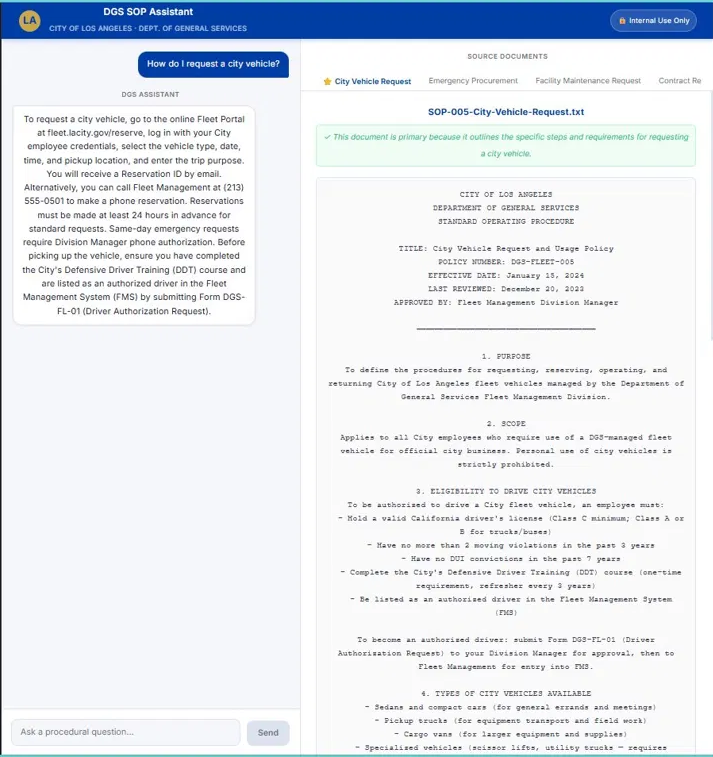

# DGS SOP Assistant
### AI-Powered Internal Chatbot — City of Los Angeles, Department of General Services

A full-stack web application that allows DGS employees to ask plain-English procedural questions and receive immediate, cited answers drawn directly from official Standard Operating Procedure (SOP) documents stored in Google Drive.

---

## What It Does

Instead of hunting through folders and PDFs, an employee types a question like *"How do I report a workplace injury?"* and gets a clear, accurate answer in seconds — with the full source document displayed alongside it for verification.



---

## Features

- 💬 **Natural language chat** with full multi-turn conversation memory
- 📂 **Live Google Drive integration** — reads directly from your SOP folder via OAuth 2.0
- 📄 **Split-panel UI** — answer on the left, full source document on the right
- 🗂️ **Up to 6 source tabs** — primary document plus related SOPs, all switchable
- 🔍 **Keyword-based relevance ranking** — surfaces the most relevant docs per query
- ⚡ **Free to run** — uses Groq's free API tier, no billing required

---

## Tech Stack

| Layer | Technology | Reason |
|---|---|---|
| Frontend | React + Vite | Component-based, fast split-panel layout |
| Backend | Python + FastAPI | Async-native, simple CORS, single-file structure |
| LLM | Groq (llama-3.3-70b-versatile) | Completely free, no credit card, strong JSON output |
| Drive Access | Google Drive REST API + OAuth 2.0 | Secure, user-authenticated, read-only scope |
| Document Retrieval | Keyword ranking + prompt injection | Effective for this scale; no RAG complexity needed |
| Conversation Memory | React useState | Stateless backend; session memory in frontend only |
| Database | None | Drive is the source of truth; no persistence needed |

---

## Data Flow

```
USER TYPES QUESTION
        │
        ▼
┌─────────────────────┐
│   React Frontend    │
│  (App.jsx)          │
│                     │
│  Stores:            │
│  - messages[]       │
│  - primaryDoc       │
│  - relatedDocs[]    │
│  - activeDocIndex   │
└────────┬────────────┘
         │ POST /api/chat
         │ { messages: [...], query: string }
         ▼
┌──────────────────────────────┐
│  Python Backend              │
│  (FastAPI main.py)           │
│                              │
│  1. OAuth → Drive service    │
│  2. Find DGS-SOPs folder     │
│  3. Fetch all .txt files     │
│  4. Build doc_map in memory  │
│  5. Rank docs by keywords    │
│  6. Select docs under limit  │
│  7. Build lean system prompt │
│  8. Call Groq API            │
│  9. Parse JSON response      │
│  10. Attach content from map │
└──────┬───────────────────────┘
       │
       ├─── Google Drive REST API ───┐
       │                             ▼
       │                  ┌─────────────────────┐
       │                  │  Google Drive       │
       │                  │  DGS-SOPs folder    │
       │                  │  7 x .txt SOP files │
       │                  └──────────┬──────────┘
       │                             │ File contents
       │                             ▼
       │                  ┌─────────────────────┐
       │                  │  Keyword Ranker     │
       │                  │  Scores + selects   │
       │                  │  top docs under     │
       │                  │  token budget       │
       │                  └──────────┬──────────┘
       │                             │
       │                  ┌──────────▼──────────┐
       │                  │  Groq API           │
       │                  │  llama-3.3-70b      │
       │                  │                     │
       │                  │  Returns:           │
       │                  │  - answer text      │
       │                  │  - doc titles only  │
       │                  └──────────┬──────────┘
       │                             │
       │                  ┌──────────▼──────────┐
       │                  │  Backend attaches   │
       │                  │  full content from  │
       │                  │  doc_map lookup     │
       │                  └──────────┬──────────┘
       │                             │ ChatResponse
       ▼                             ▼
┌─────────────────────────────────────────┐
│   React Frontend                        │
│                                         │
│  LEFT PANEL: Answer in chat thread      │
│  RIGHT PANEL: Full source doc + tabs    │
└─────────────────────────────────────────┘
```

---

## Project Structure

```
dgs-sop-assistant/
├── docs/
│   ├── business_statement.md
│   ├── logical_structure.md
│   └── technical_implementation.md
├── backend/
│   └── main.py
├── frontend/
│   └── src/App.jsx
├── requirements.txt
└── README.md
```

---

## Getting Started

### Prerequisites
- Python 3.11+
- Node.js 18+
- Free Groq API key → [console.groq.com](https://console.groq.com)
- Google Cloud project with Drive API enabled and `credentials.json` downloaded

### Backend
```bash
python -m venv venv
venv\Scripts\activate        # Windows
source venv/bin/activate     # Mac/Linux

pip install -r requirements.txt

# Create a .env file in the project root:
# GROQ_API_KEY=your_key_here

cd backend
uvicorn main:app --reload --port 8000
```
On first run, a browser window opens for Google OAuth. Sign in and approve Drive access.

### Frontend
```bash
cd frontend
npm install
npm run dev
```
Open [http://localhost:5173](http://localhost:5173)


